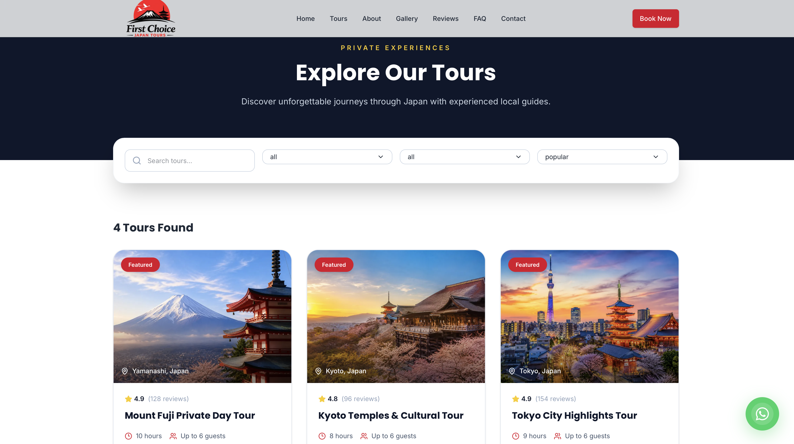
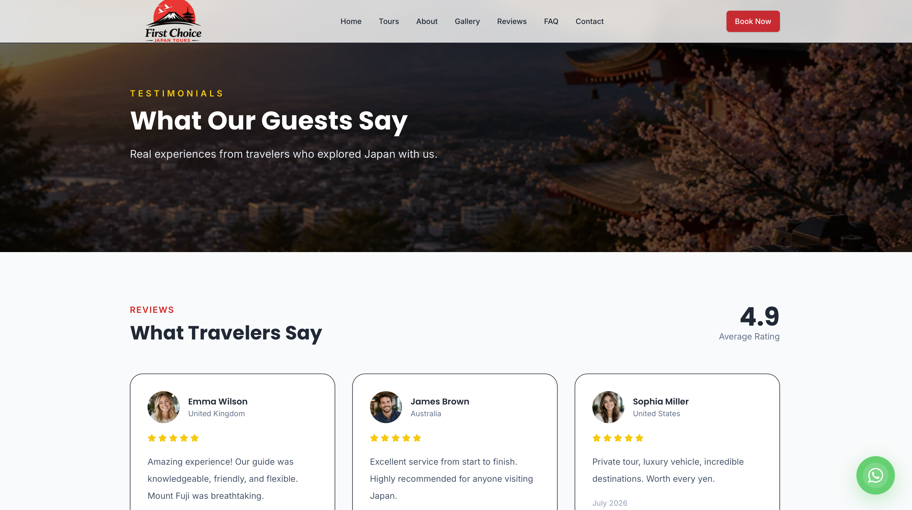
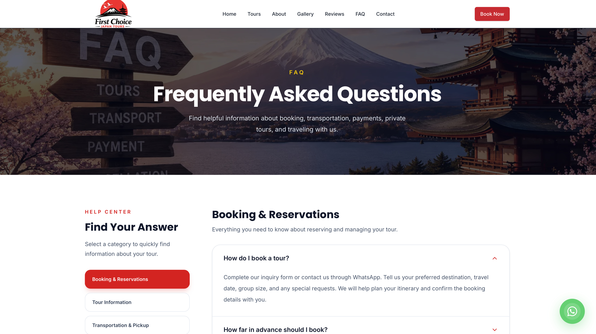
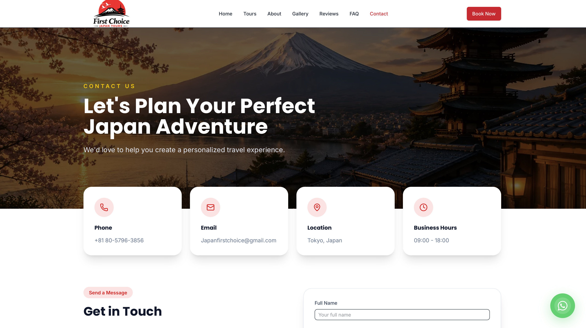

# First Choice Japan Tours

A modern and responsive travel website designed for a Japan-based tour company.

The website showcases popular destinations, tour packages, customer reviews, travel information, and inquiry options for travelers interested in visiting Japan.

## Live Demo

[View Live Website](https://first-choice-japan-tours.vercel.app/)

## Screenshots

### Home


### Tours


### Gallery


### Reviews



### FAQ



### Contact



## Overview

First Choice Japan Tours was developed as a modern tourism website focused on usability, responsive design, reusable components, and a clean user experience.

The project includes destination information and tour experiences for popular locations in Japan such as:

* Tokyo
* Kyoto
* Osaka
* Nara
* Mount Fuji

The application was built with a component-based and feature-based architecture to keep the code organized, reusable, and maintainable.

## Features

* Responsive design for desktop, tablet, and mobile
* Modern homepage with hero section
* Featured tour packages
* Popular destination section
* Individual tour detail pages
* Dynamic tour routing
* Tour filtering
* Tour overview information
* Tour highlights
* Detailed itineraries
* Included service information
* Tour galleries
* Customer reviews and testimonials
* Related tour suggestions
* Tour inquiry section
* Image gallery
* FAQ section
* About page
* Contact page
* Contact information section
* Integrated map section
* Floating WhatsApp contact button
* Responsive mobile navigation
* Reusable layout and UI components
* Loading page
* Custom 404 page
* Error handling pages
* SEO metadata
* Sitemap generation
* robots.txt configuration
* Web application manifest
* Open Graph image
* Custom favicons

## Technologies Used

#### Frontend

* Next.js
* React
* TypeScript
* Tailwind CSS

#### UI and Components

* shadcn/ui
* Lucide React
* Reusable React components
* Responsive layout components

#### Development Tools

* Git
* GitHub
* npm
* Visual Studio Code

## Project Structure

## Project Structure

The application uses a feature-based architecture.

```text
src/
├── app/
│   ├── about/
│   ├── contact/
│   ├── faq/
│   ├── gallery/
│   ├── reviews/
│   ├── tours/
│   ├── config/
│   ├── error.tsx
│   ├── global-error.tsx
│   ├── layout.tsx
│   ├── loading.tsx
│   ├── manifest.ts
│   ├── not-found.tsx
│   ├── page.tsx
│   ├── robots.ts
│   └── sitemap.ts
│
├── components/
│   ├── common/
│   ├── layout/
│   └── ui/
│
├── constants/
├── data/
├── features/
│   ├── about/
│   ├── contact/
│   ├── faq/
│   ├── gallery/
│   ├── home/
│   ├── reviews/
│   └── tours/
│
├── lib/
├── providers/
└── types/ 
```
This structure separates application features into dedicated modules while keeping reusable components in centralized locations.

## Main Pages

## Home

The homepage introduces the travel company and provides quick access to important information such as:

* Hero section
* Featured tours
* Popular destinations
* Company statistics
* Why choose us
* Gallery
* Testimonials
* Call-to-action sections

## About

The About page provides information about the company and includes:

* Company introduction
* Company story
* Statistics
* Team section
* Reasons to travel with the company

## Tours

The Tours page allows visitors to explore available travel packages.

## Features include:

* Tour cards
* Tour filtering
* Responsive tour grid
* Dedicated tour detail pages

## Dynamic Tour Pages

Individual tour pages use dynamic routing through:

```/tours/[slug]```

Each tour page can contain:

* Tour hero section
* Overview
* Highlights
* Gallery
* Itinerary
* Included services
* Booking information
* Reviews
* Social sharing options
* Related tours
* Inquiry section

This approach allows tour information to be managed using reusable components and structured data.

## Tour Filtering

The project includes filtering functionality for tour packages.

Tour filtering logic is separated into reusable hooks and utility functions:
```
src/features/tours/hooks/use-tour-filter.ts
src/features/tours/utils/filter-tours.ts
```
This helps keep the UI components separate from filtering logic and improves maintainability.

## Gallery

The website includes dedicated gallery functionality with responsive image layouts.

Visitors can explore travel images related to destinations and experiences across Japan.

## Reviews

The reviews section displays customer experiences and testimonials using reusable review components.

Reviews are used throughout both the homepage and dedicated review sections.

## FAQ

The FAQ page provides frequently asked questions using accordion-based UI components.

This helps travelers quickly find common information before making an inquiry.

## Contact

The contact page contains:

* Contact form
* Contact details
* Location information
* Map section
* Additional inquiry options

A floating WhatsApp contact button is also available for convenient communication.

## Reusable Components

The project contains reusable components to maintain a consistent design throughout the website.

Examples include:

* Buttons
* Cards
* Dialogs
* Navigation menus
* Accordions
* Input fields
* Select components
* Text areas
* Sheets
* Badges
* Skeleton loaders
* Section headings
* Containers
* Responsive sections
* Navigation bar
* Footer
* Mobile menu

## Responsive Design

The application was designed to adapt across multiple screen sizes.

Supported layouts include:

* Desktop
* Laptop
* Tablet
* Mobile

Responsive behavior has been implemented for navigation, tour cards, galleries, text sections, forms, and page layouts.

## SEO and Web Metadata

The project includes several features designed to improve search-engine visibility and web presentation.

These include:

* Metadata configuration
* Open Graph image
* Sitemap generation
* robots.txt generation
* Web application manifest
* Custom favicon files
* Apple touch icon
* Dynamic page structure

## Performance and Production Build

The application supports optimized Next.js production builds.

A successful production build verifies:

* TypeScript validation
* Static page generation
* Dynamic route handling
* Production optimization

Build the application using:
```
npm run build
```
## Installation

Clone the repository:
```
git clone https://github.com/PawanLahiru/first-choice-japan-tours.git
```
Move into the project folder:
```
cd first-choice-japan-tours
```
Install dependencies:
```
npm install
```
Start the development server:
```
npm run dev
```
Open your browser and visit:
```
http://localhost:3000
```
## Production Build

Create an optimized production build:
```
npm run build
```
Start the production server:
```
npm start
```
## Purpose of the Project

This project demonstrates practical frontend and web-development skills, including:

* Building responsive user interfaces
* Developing reusable React components
* Working with Next.js routing
* Using TypeScript for safer application development
* Organizing larger applications using feature-based architecture
* Managing structured application data
* Creating dynamic pages
* Implementing responsive navigation
* Building filtering functionality
* Improving SEO structure
* Using Git and GitHub for version control

## Future Improvements

Possible future improvements include:

* Online booking system
* User authentication
* Customer accounts
* Tour reservation management
* Online payment integration
* Admin dashboard
* Content management system
* Multilingual support
* Database integration
* Email notification system
* Real-time tour availability
* Advanced search and filtering

## Author

Pawan Lahiru

Software / Web Developer based in Kyoto, Japan.

## Portfolio
```
https://pawanlahiru.github.io/Portfolio/
```
GitHub
```
https://github.com/PawanLahiru
```
